# 🛠️ Editor de Placas (PCB Layout)

Una vez que el diseño lógico ha sido validado en el esquemático, el siguiente paso crítico en nuestro flujo de trabajo es la traducción de este circuito a su forma física. En esta sección documentamos la importación de huellas (footprints), la definición del área de trabajo, el ruteo y la preparación para la exportación a manufactura CNC.

---

## 1. Transición al Entorno de PCB

Para comenzar con el diseño físico, utilizamos el botón **Abrir editor de placas** ubicado en la barra de herramientas superior del Eeschema. Una vez listo el esquemático, vas a ir a la esquina superior izquierda y vas a dar clic en el icono verde que está marcado en la imagen con un cuadro rojo, para empezar con el editor de placas[cite: 9].

| Icono Editor de Placas | Acceso desde Eeschema |
| :---: | :---: |
|  |  |

!!! warning "Importante: Gestión del Proyecto"
    Es fundamental realizar este paso con la ventana principal del **Proyecto de KiCad** abierta en segundo plano. Si se abre el editor de placas de manera independiente, el software perderá el enlace con el esquemático, imposibilitando la sincronización de componentes y arrojando errores de conectividad al intentar actualizar.

---

## 2. Sincronización y Organización de Componentes

Con el editor de placas abierto, procedemos a importar los componentes lógicos a su representación física. Esto se logra ejecutando la herramienta **Actualizar placa desde esquema** (atajo de teclado `F8`). 

Al aplicar los cambios, tus componentes aparecerán así en la parte principal de la pantalla y, como se puede observar en las flechas, hay pequeñas líneas azules que conectan los componentes entre sí[cite: 9]. A esta red de guías virtuales se le conoce como **Ratsnest** (nido de ratas), el cual nos indica el orden, la topología y el destino exacto de cada conexión.

| Ventana de Actualización | Disposición con Ratsnest |
| :---: | :---: |
|  | 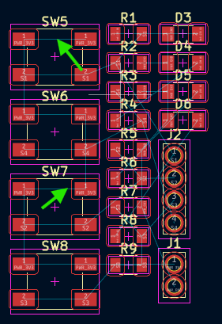 |

*Disposición de los componentes interconectados mostrando las conexiones virtuales.*

---

## 3. Configuración de Capas de Trabajo y Reglas de Diseño (DRC)

Antes de iniciar el trazado de pistas o contornos, debemos comprender el apilamiento de capas (Layer Stackup). Dado que el diseño actual es una placa de cara simple (una sola capa de cobre), todo nuestro trabajo conductivo se realizará en la capa **F.Cu** (Front Copper / Cobre Frontal).

En la parte superior izquierda podemos observar una opción que dice “Pista: usar el ancho de clase de red”; le vas a dar clic y te abrirá una lista de opciones y después pondrás la opción de editar tamaños predefinidos que está seleccionada con color morado[cite: 9].

*Selección rápida de anchos de pista predefinidos.*

Te aparecerán varias opciones, pero las importantes son los tamaños predefinidos; darás clic en la parte de abajo donde hay un signo de más (+) y añadirás dos medidas: una de **0.4 mm** y otra de **0.8 mm**, igual como se muestra en la imagen[cite: 9].

| Configuración de Tamaños Predefinidos | Menú de Propiedades de la Placa |
| :---: | :---: |
| 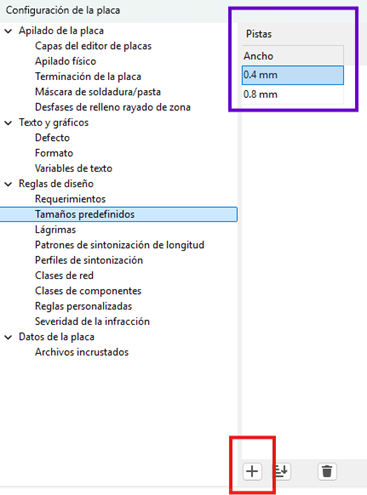 |  |

*Definición de márgenes mínimos, aislamiento y tolerancias de diseño.*

!!! info "Parámetros para CNC Monofab SRM-20"
    Se estableció un **ancho de pista de 0.4 mm** para las líneas de señal. Este grosor garantiza que la fresadora pueda aislar las pistas correctamente sin comprometer su integridad mecánica ni su conductividad.

---

## 4. Enrutamiento y Conexiones (Capa F.Cu)

Seleccionarás la medida de 0.4 mm y es hora de conectar todos tus componentes[cite: 9].

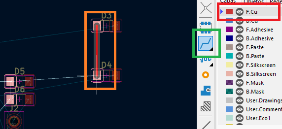

Después, deberás seleccionar la capa **F.Cu** que está marcada con un recuadro rojo y usarás la herramienta que está marcada de verde (Enrutar pistas), que nos va a ayudar a poder conectar nuestros componentes, de igual manera como se logra ver en el recuadro naranja[cite: 9].

| Selección de Capa F.Cu | Herramienta de Enrutamiento |
| :---: | :---: |
| 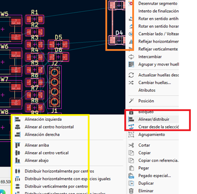 |  |

Al seleccionar la herramienta de pistas y hacer clic sobre un pad, KiCad ilumina automáticamente los pads de destino correspondientes, facilitando la visualización del camino a seguir.

| Resaltado de Destino | Conexión Completada |
| :---: | :---: |
|  |  |

### Herramientas de Alineación y Buenas Prácticas
Algunas opciones para acomodar mejor tus componentes es seleccionar dos componentes y dar clic derecho, seleccionar **alinear/distribuir**; puedes ocupar la alineación a la izquierda o las otras alineaciones para ayudarte a acomodar tus componentes[cite: 9].

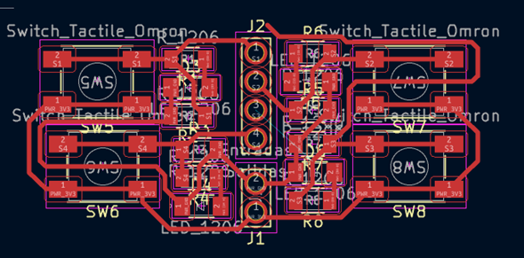
*Menú contextual para simetría y distribución de huellas.*

Cuando juntes tus componentes, recuerda que **no debe haber ángulos de 90°** en las líneas rojas y tampoco se pueden encimar[cite: 9].

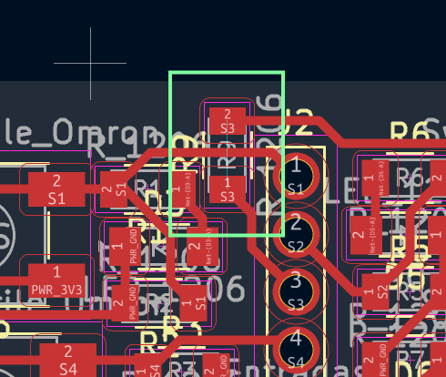
*Trazos óptimos a 45 grados evitando esquinas de 90 grados.*

---

## 5. Trucos de Ruteo: Puentes (Jumpers)

Al trabajar exclusivamente en una cara (Capa `F.Cu`), es común encontrarnos con cruces inevitables donde una pista bloquea el paso de otra.

Aunque cuando llega a pasar el caso de necesitar poner una línea encima de la otra, puedes ocupar el truco de la **resistencia 0**[cite: 9]. El truco consiste en agregar una resistencia 0 (0 ohmios) y poder unir las dos líneas actuando físicamente como un puente o "jumper", aunque tengas una línea de frente igual como se muestra en el recuadro verde[cite: 9].

| Implementación Práctica del Jumper | Vista en el Layout |
| :---: | :---: |
|  |  |

!!! tip "Consideración en el DRC"
    El uso de este puente puede generar advertencias en el chequeo de reglas de diseño (DRC), ya que lógicamente el software lo ve como una interrupción de la red. Sin embargo, en la manufactura física, esta es una técnica completamente válida y la advertencia puede ser ignorada de forma segura.

---

## 6. Delimitación del Contorno (Edge.Cuts)

Toda PCB necesita un límite físico definido para que la máquina CNC o el fabricante sepa por dónde cortar la placa terminada. 

Una vez ya tengas tus componentes acomodados y conectados, vas a seleccionar la capa **Edge.Cuts** y deberás usar las diferentes herramientas (como crear cuadrados regulares, círculos regulares y polígonos irregulares) para poder crear una figura alrededor de tus componentes haciendo la delimitación de la placa[cite: 9].

*Selección de la capa Edge.Cuts y herramienta gráfica.*

El contorno de tu figura debería verse algo parecido a esta imagen[cite: 9].

*Geometría de corte exterior encapsulando los componentes.*

Si das doble clic en el cuadro te aparecerán las propiedades de la figura que creaste, aunque del lado izquierdo en el rectángulo violeta también podrás observar las propiedades[cite: 9].

*Inspector de propiedades del trazado.*

Deberás cambiar el ancho de la línea dependiendo los puntos que tengas disponibles para tu máquina; en mi caso son **dos milímetros**, el estado de línea debe ser sólida y en relleno es ninguno, además de observar la capa en la que se encuentra tu figura, es importante que esté en **Edge.Cuts**[cite: 9].

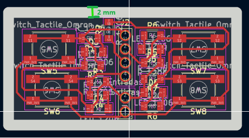
*Configuración geométrica adaptada a la fresa de la CNC.*

Como puedes observar, las líneas de la figura que está alrededor de tu circuito ya miden **2mm de ancho**, el tamaño de la broca que se tiene[cite: 9]. Para confirmar esto, podemos usar la **Herramienta de medida (Ctrl+Shift+M)**.

| Verificación de Grosor (Cota) | Herramienta de Medición |
| :---: | :---: |
| 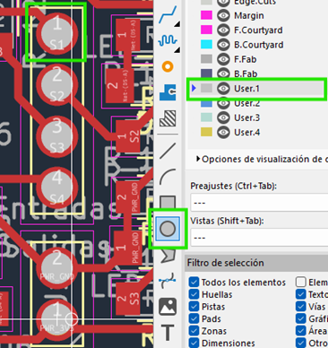 |  |

---

## 7. Perforaciones Manuales (Capas de Usuario)

Para la colocación de pines (pin headers) y sujeciones, necesitamos definir perforaciones precisas sin interferir con las capas estándar.

Cuando acabes con la figura de alrededor, seleccionarás la capa **User.1** y pondrás la herramienta de círculo para crear círculos en la parte de pines, voltaje y GND; es importante que sean del mismo tamaño de los agujeros[cite: 9]. 

!!! info "Gestión de Capas de Usuario"
    *   **User.1** es para perforaciones[cite: 9].
    *   **User.2** va a ser para etiquetas[cite: 9].
    *   **User.3** se ocupa normalmente para círculos donde van los tornillos[cite: 9].

| Trazado en User.1 | Ajuste de Radio y Relleno |
| :---: | :---: |
|  |  |

Con la herramienta de círculo dibujamos guías con la propiedad de **Rellenar con Sólido** y un radio de aproximadamente 0.72 mm a 0.8 mm. Es vital asegurarse de que estos círculos queden perfectamente centrados en los pads para guiar la broca.

---

## 8. Creación de Zonas de Cobre (Copper Pour)

El último paso del diseño físico consiste en generar una zona de relleno (Copper Pour). Esto delimita el área de cobre que la CNC debe procesar y optimiza el tiempo de fresado al evitar remover material innecesario.

Después vas a seleccionar la capa **F.Cu** otra vez, donde darás clic en la herramienta de añadir zonas rellenas y te aparecerá una advertencia (indicando `<sin red>`); lo único que debes hacer es dar clic en aceptar[cite: 9].

| Selección de Herramienta | Advertencia de Zona |
| :---: | :---: |
|  | 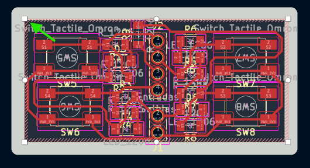 |

Una vez le des clic en la herramienta te aparecerá una forma parecida a la del polígono irregular, es importante que cierres bien el sistema trazando el polígono por el interior de nuestro contorno para que se vea rojo el polígono[cite: 9]. La regla fundamental es que **el polígono debe ser un lazo completamente cerrado**.

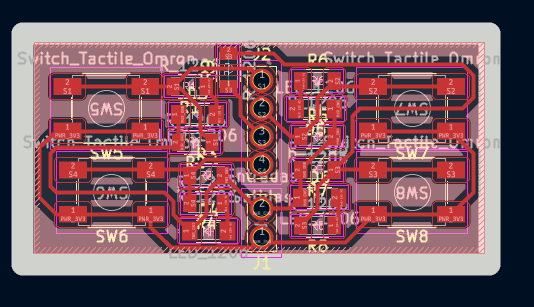
*El contorno del área de relleno delimitando todo el circuito.*

---

## 9. Ejecución del Relleno de Cobre

Y por último, solo deberás presionar la **tecla B** para que se complete la figura[cite: 9]. Este comando obliga a KiCad a recalcular y renderizar el relleno de cobre, esquivando automáticamente las pistas y los pads según las reglas de aislamiento configuradas previamente.

| Polígono Procesado | Detalle de Aislamiento |
| :---: | :---: |
| 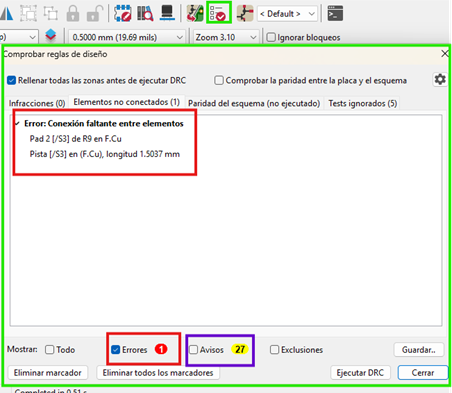 |  |

*Visualización general de la placa terminada en alto contraste.*

---

## 10. Verificación de Reglas de Diseño (DRC)

El último filtro de seguridad antes de fabricar es ejecutar el **DRC (Design Rule Checker)**. A diferencia del ERC en el esquemático, el DRC verifica errores físicos.

Para comprobar si hay errores en la placa existe la herramienta que está seleccionada con el cuadrado verde y te abrirá el cuadro verde más grande[cite: 9]. En la parte inferior, en el recuadro rojo, podrás observar los errores que están en la placa; en mi caso me aparece un error, pero es porque falta una conexión, pero esa conexión ya está conectada internamente en los botones, por lo tanto no es tan importante conectarlas[cite: 9]. 

Los avisos que están en amarillo no afectan al funcionamiento de la placa, es normal que aparezcan varios avisos al crear una placa tan compacta[cite: 9].

| Botón Ejecutar DRC | Resultados de la Verificación |
| :---: | :---: |
|  |  |

---

## 11. Inspección en el Visor 3D y Orientación

Antes de exportar los archivos para fabricación, es una excelente práctica revisar el aspecto físico de la placa. Otra de las herramientas es la que está en la parte superior y se llama **visor 3D (Alt+3)**, te ayuda a observar tu placa en formato 3D con sus componentes y todo[cite: 9].

| Acceso al Visor 3D | Renderizado Frontal |
| :---: | :---: |
| 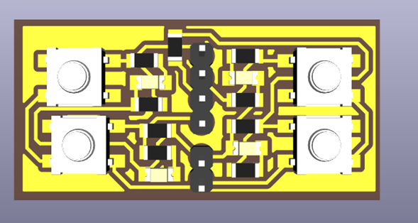 |  |

Al darle clic podrás visualizar en tercera dimensión tu placa, lo que te puede ayudar a ver si los componentes están organizados de buena forma o si necesitan algún arreglo y verificar que las perforaciones mecánicas no colisionen[cite: 9].

*Inspección final isométrica de la distribución física.*

Por la forma de la cortadora de monofab y la placa, es importante que coloques tu figura en la dirección que más te convenga; solo tienes que seleccionar toda tu placa y presionar la **letra R** para rotar[cite: 9].

*Orientación geométrica de todo el bloque (Rotate).*

---

## 12. Salidas de Fabricación (Exportación SVG)

Para procesar nuestra placa en la fresadora CNC, necesitamos exportar el diseño. Cuando ya tengas tu placa sin errores y con la dirección correcta, es hora de que te vayas a la ventana de archivo, luego a **salidas de fabricación** y por último a **Gerbers**[cite: 9].

*Acceso al menú de exportación de archivos.*

Te abrirá una ventana y apretarás en la ventana roja donde diga Gerber y seleccionarás **SVG**[cite: 9]. En el recuadro naranja encontrarás una lista de las capas y seleccionarás las capas que ocupaste, en nuestro caso serían **F.Cu, Edge.Cuts, y User.1**[cite: 9].

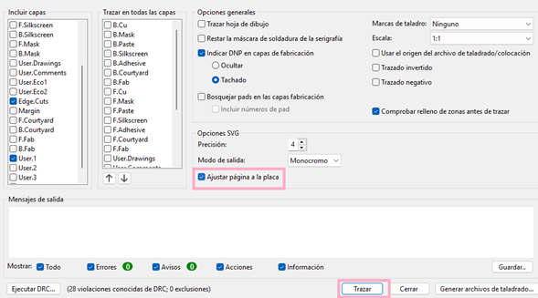
*Selección del formato vectorial monocromático y las capas necesarias.*

Para finalizar, seleccionarás la opción de **Ajustar página a la placa** y después pondrás en **Trazar**, lo que te creará la misma cantidad de archivos que seleccionaste en incluir capas en la misma carpeta de tu proyecto[cite: 9].

*Ejecución de la herramienta de trazado vectorial.*

### Archivos de Salida (Arte de Manufactura)

Como resultado, KiCad generará un conjunto de archivos `.svg` independientes. Podrás abrir cada uno de los archivos para comprobar que todo esté bien y ponerles su respectivo nombre[cite: 9].

*Listado de archivos vectoriales (Bordes, Perforaciones y Pistas) listos para el maquinado CAM.*

A continuación, se muestra una previsualización del archivo de pistas principales. Este formato de alto contraste permite al software de la fresadora calcular las rutas de corte impecablemente.

*Vista de alto contraste del arte generado para la capa de cobre frontal.*
