# 4. Operación de la Fresadora Roland MonoFab SRM-20

!!! abstract "Objetivo de esta fase"
    Una vez generados los archivos de trayectorias (`.rml`) en Mods CE, es el momento de pasar al entorno físico. Esta sección detalla la preparación, calibración y operación de la fresadora **Roland MonoFab SRM-20** utilizando su software de control nativo, VPanel, para materializar nuestra placa de circuito impreso (PCB).

---

## 4.1 Instalación de Controladores (Drivers) de la SRM-20

Antes de instalar el software de control VPanel, es un requisito indispensable que la computadora cuente con los controladores para poder comunicarse y reconocer la fresadora[cite: 1].

1. Dirígete al centro de descargas oficial de Roland DG ingresando al enlace: [downloadcenter.rolanddg.com/SRM-20](https://downloadcenter.rolanddg.com/SRM-20)[cite: 1].

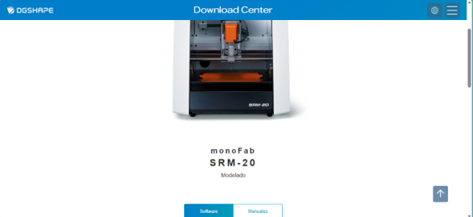
*Figura 4.1: Portal oficial de descargas DGSHAPE.*

2. Navega hasta la pestaña **Driver**[cite: 1]. En esta sección, descarga e instala el controlador que corresponda a la arquitectura de tu versión de Windows, tomando en cuenta que el sistema es compatible con Windows 10 y Windows 11[cite: 1].

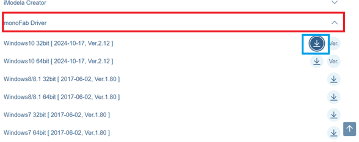
*Figura 4.2: Selección del driver compatible con el sistema operativo.*

3. Una vez finalizada la instalación del controlador, conecta la fresadora SRM-20 a la computadora utilizando el cable USB y enciende la máquina para asegurar que el sistema operativo reconozca el dispositivo correctamente[cite: 1].

---

## 4.2 Descarga e Instalación de VPanel for SRM-20

El siguiente paso es obtener la interfaz gráfica de usuario que nos permitirá enviar los archivos y controlar los movimientos de la fresadora.

1. Dentro de la misma página del centro de descargas, cambia a la pestaña de **Software**[cite: 1].
2. Desplázate por la lista hasta encontrar la aplicación **VPanel for SRM-20** y haz clic en el botón de descarga[cite: 1].

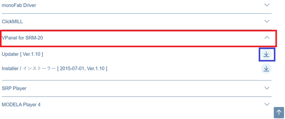
*Figura 4.3: Localización del software de control VPanel.*

3. Localiza el archivo instalador (`.exe` o carpeta comprimida) que se descargó[cite: 1]. Haz clic derecho sobre el ejecutable y selecciona **"Ejecutar como administrador"** para otorgarle los permisos necesarios al sistema[cite: 1].

*Figura 4.4: Ejecutable del instalador VPanel.*

4. Sigue todas las instrucciones y ventanas de diálogo del asistente de instalación (`setup`) hasta que el proceso haya concluido[cite: 1].

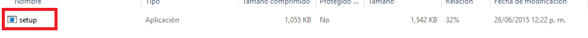
*Figura 4.5: Aplicación Setup del software.*

---

## 4.3 Interfaz de Usuario y Controles de VPanel

Una vez completada la instalación, localiza el acceso directo en tu escritorio o en el menú de inicio y abre la aplicación **VPanel for SRM-20**[cite: 1]. 

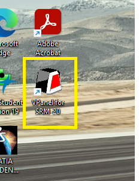
*Figura 4.6: Icono de escritorio de VPanel.*

Si la máquina está encendida y conectada correctamente, el programa detectará automáticamente el estado del equipo y habilitará la interfaz[cite: 1].

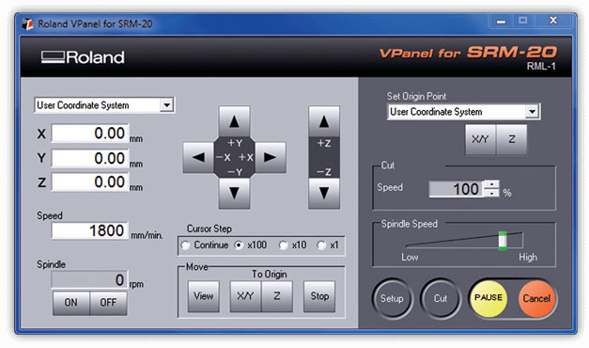
*Figura 4.7: Interfaz gráfica principal.*

Para operar la máquina con seguridad, es fundamental comprender las funciones de los paneles de control:

*   **Controles de Ejes (X, Y, Z):** Las flechas direccionales te permitirán mover la herramienta en el espacio físico[cite: 1]. Los botones agrupados en el recuadro amarillo desplazan el **Eje X** y muestran sus coordenadas[cite: 1]. Los botones delimitados en rojo controlan el **Eje Y**[cite: 1]. Finalmente, los botones verticales marcados en azul controlan la altura o el **Eje Z**[cite: 1].
    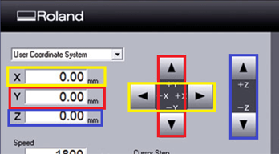

*   **Paso del Cursor (Cursor Step):** Este apartado, en el recuadro naranja, regula la magnitud o distancia que se moverá la máquina con cada clic[cite: 1]. La opción **"Continue"** genera movimientos prolongados y rápidos[cite: 1]. Las demás opciones (x100, x10, x1) limitan el desplazamiento para lograr aproximaciones milimétricas y seguras[cite: 1].
    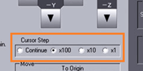

*   **Mover al Origen (Move To Origin):** Situados en la parte inferior, el botón del recuadro rojo envía automáticamente la máquina a sus coordenadas (0,0) guardadas para los ejes X y Y[cite: 1]. El botón del recuadro azul retorna el husillo a la coordenada de origen 0 del eje Z[cite: 1].
    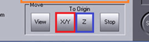

*   **Control del Husillo (Spindle):** Ubicado en la esquina inferior izquierda, los botones **ON** y **OFF** sirven para encender o apagar la rotación mecánica del motor, haciendo que la fresa comience a girar para desgastar el material[cite: 1].
    

*   **Establecer Origen (Set Origin Point):** En la esquina superior derecha, los botones **X/Y** y **Z** sirven para guardar la posición actual de la máquina y declararla permanentemente como el nuevo punto de inicio (0,0,0) del trabajo[cite: 1].
    

---

## 4.4 Preparación del Material y Cama de Sacrificio

Para comenzar a fabricar el diseño, vas a requerir 5 elementos físicos principales[cite: 1]:
1.  **Placa fenólica (cobre y fibra de vidrio):** El material base de tu circuito[cite: 1].
2.  **Cama de sacrificio de MDF:** Una base de madera para proteger la plataforma de aluminio de la máquina[cite: 1].
3.  **Fresa de 2 mm:** Para cortar y separar el contorno completo de la placa[cite: 1].
4.  **Broca de 0.8 mm:** Para realizar todas las perforaciones pasantes[cite: 1].
5.  **Fresa plana de 0.4 mm:** Para el ruteo, aislamiento y trazado fino de las pistas[cite: 1].

[Descargar Sacrificio SS.dxf](recursos/archivos/Sacrificio%20SS.dxf){ .md-button .md-button--primary }

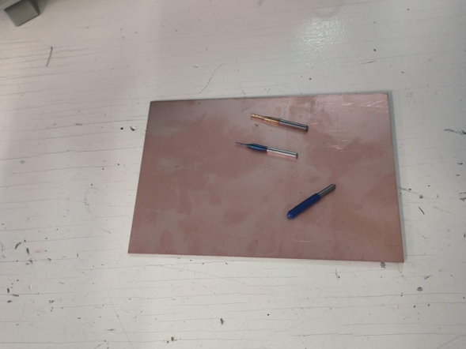
*Figura 4.8: Placa virgen y fresas de diferentes medidas.*

!!! tip "Fijación de la placa"
    Con la ayuda de cinta adhesiva de doble cara, pega la placa de cobre directamente sobre la tabla de sacrificio de MDF[cite: 1]. Es muy importante presionar bien y garantizar que quede **completamente derecha y plana** para que no se mueva por la vibración y para evitar desniveles que impidan un desgaste de cobre uniforme a la hora de cortar[cite: 1].

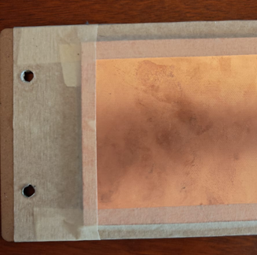
*Figura 4.9: PCB adherida a la cama de sacrificio.*

Una vez lista, introduce la placa de sacrificio en la máquina y fíjala correctamente alineando y apretando los tornillos de fijación en los agujeros roscados de la plataforma de la fresadora[cite: 1].

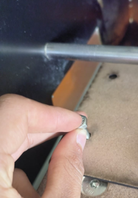
*Figura 4.10: Sujeción de la cama de MDF en la SRM-20.*

Con la ayuda de la **llave Allen** incluida con el equipo, afloja el tornillo prisionero del cabezal para insertar la herramienta[cite: 1]. Es similar a la mecánica de un mandril de taladro[cite: 1]. El orden técnico de fresado indica que siempre **se empieza por las perforaciones**, por lo tanto, inserta primero la broca de 0.8 mm y apriétala firmemente[cite: 1].

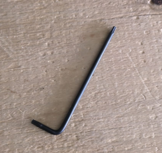
*Figura 4.11: Llave Allen para ajuste de fresas.*

---

## 4.5 Calibración de Coordenadas de Origen (Zero X, Y, Z)

Con la placa atornillada y la broca colocada, procede a establecer el punto de partida (Origen). 

1. **Calibración X / Y:** Emplea las flechas de la interfaz (Ejes X y Y) para desplazar el cabezal de la herramienta hasta ubicarlo con precisión sobre la esquina inferior izquierda de tu placa de cobre[cite: 1]. 

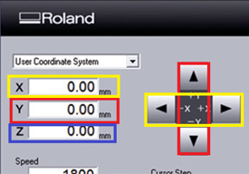
*Figura 4.12: Posicionamiento en el plano horizontal X-Y.*

2. Cuando la punta se encuentre perfectamente posicionada en dicha esquina inferior izquierda, presiona el botón **X/Y** ubicado bajo el apartado *Set Origin Point* (recuadro rojo) para guardar esas coordenadas como el inicio del diseño[cite: 1].

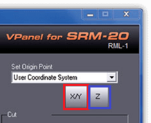
*Figura 4.13: Declaración del cero en los ejes X y Y.*

3. **Calibración Z:** Ahora debemos ajustar la altura[cite: 1]. Utiliza las flechas verticales de la interfaz para comenzar a descender la herramienta poco a poco hacia la superficie del cobre[cite: 1].

*Figura 4.14: Aproximación de la fresa a la placa.*

!!! danger "Precaución: Calibración final del eje Z"
    Cuando la herramienta esté muy cerca del material, enciende el husillo presionando el botón **ON** (*Spindle*)[cite: 1]. Con el motor girando, disminuye el *Cursor Step* a la mínima expresión (x1 o x10) y baja muy lentamente paso a paso[cite: 1]. **Detente inmediatamente** en cuanto escuches fricción y veas que sale un poco de polvo brillante de la placa[cite: 1]. Ese momento exacto es la superficie Z-0.
    Guarda la coordenada haciendo clic en el botón **Z** de *Set Origin Point* y recuerda siempre alzar o subir la punta unos milímetros en la interfaz antes de presionar el botón OFF para apagar la rotación[cite: 1].

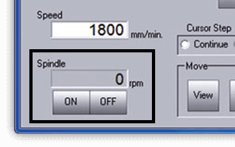
*Figura 4.15: Declaración del cero en el eje Z.*

---

## 4.6 Proceso de Mecanizado (Corte)

Con la máquina calibrada, presiona el botón central que indica **"Cut"**[cite: 1].

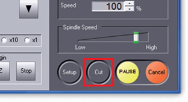
*Figura 4.16: Preparación para envío de código G.*

En la ventana de procesamiento:
1.  Haz clic en el botón **"Add"** (recuadro azul) y selecciona el archivo `.rml` que hayas generado en Mods CE correspondiente a la etapa a realizar[cite: 1].
2.  Una vez que el archivo aparezca en la lista, presiona el botón **"Output"** (recuadro naranja) para iniciar el trabajo de fresado[cite: 1].

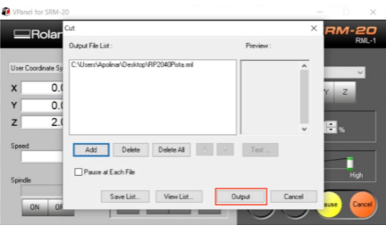
*Figura 4.17: Carga del archivo RML y comando de Output.*

!!! warning "Durante el corte"
    Cuando la máquina comience a ejecutar sus trayectorias, es imperativo que la computadora no entre en suspensión y no se apague bajo ninguna circunstancia, ya que esto cortará la comunicación serial y arruinará el trabajo[cite: 1].

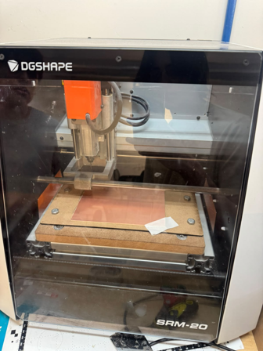
*Figura 4.18: Fresadora operando sobre el panel.*

Recuerda siempre mantener la rigurosa secuencia de trabajo: primero las **perforaciones (0.8 mm)**, seguido del ruteo de **pistas (0.4 mm)** y, al final, el corte de **contorno (2 mm)**[cite: 1]. 

Al momento de realizar el cambio de punta para avanzar a la siguiente etapa, **solo debes calibrar las nuevas coordenadas del eje Z** repitiendo el proceso de aproximación[cite: 1]. Las coordenadas guardadas en los ejes X y Y seguirán siendo exactamente las mismas; no las alteres[cite: 1].

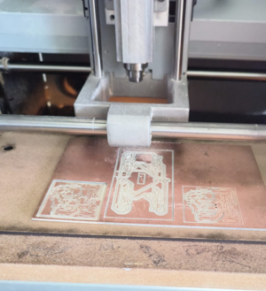
*Figura 4.19: Detalle del desbaste superficial.*

Cada vez que finalice el maquinado de un archivo, abre la cubierta acrílica de seguridad y utiliza una aspiradora para retirar rápidamente todo el polvo de cobre y fibra de vidrio suelto, garantizando una superficie limpia para la siguiente herramienta[cite: 1]. 

Al terminar completamente el contorno, desenrosca los tornillos de la plataforma y despega gentilmente la PCB completada de tu cama de sacrificio[cite: 1].

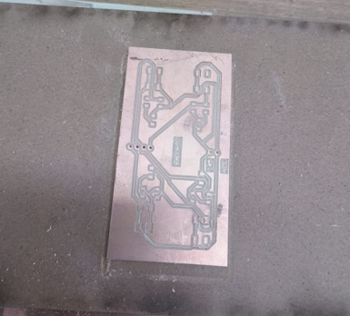
*Figura 4.20: Placa de circuito impreso exitosamente fabricada.*
